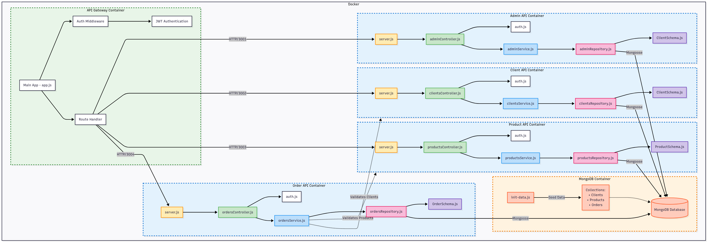
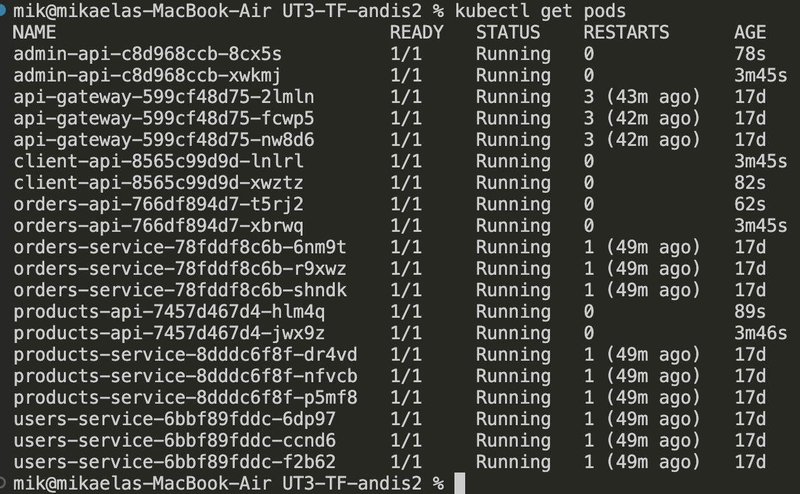
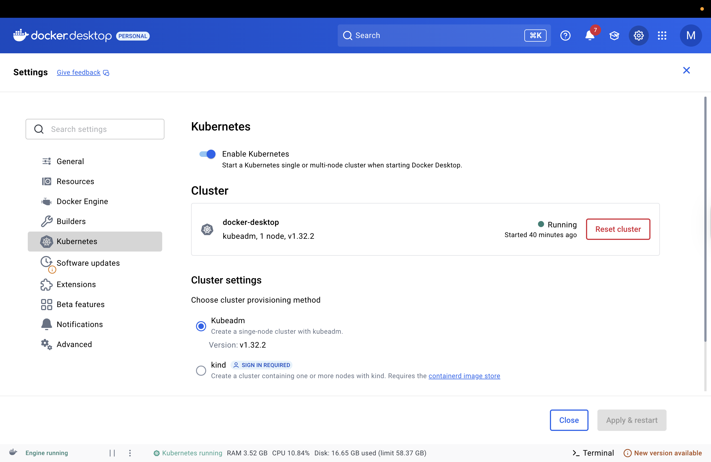

# UT3-TFU Andis II

## Pasos para correrlo:
1. npm install
2. docker compose up --build
3. npx serve

## Configuración:
- Las variables de entorno están en el archivo `.env`
- Los usuarios están definidos en `userService.js`
- La aplicación corre en puerto 3000 (contenedor) y se expone directamente en puerto 8080
- Configurado para usar exactamente 8 workers (escalabilidad horizontal)

## Permisos:
- **Alice (cliente)**: Puede ver productos, acceder a recursos protegidos, y crear órdenes.
- **Bob (admin)**: Puede crear/modificar productos, gestionar clientes, ver órdenes, pero NO puede crear órdenes (solo los clientes pueden comprar).

## Pasos para el postman:

### GetHealth
GET http://localhost:8080/health

---
### LoginWithAlice
POST http://localhost:8080/login

    {
      "username": "alice",

      "password": "alicepass"
    }

---
### LoginWithBob
POST http://localhost:8080/login

    {
      "username": "bob",

      "password": "bobpass"
    }

---
### ProtectedWithTokenAlice
GET http://localhost:8080/protected

- Key: Authorization
- Value: Bearer {Token id de Alice}

---
### ProtectedWithTokenBob
GET http://localhost:8080/protected

- Key: Authorization
- Value: Bearer {Token id de Bob}

---
### AdminOnly
GET http://localhost:8080/admin-only

- Key: Authorization
- Value: Bearer {Token id de Bob}

---
### ListOfProductsAlice
GET http://localhost:8080/products

- Key: Authorization
- Value: Bearer {Token id de Alice}

---
### CreateProduct
POST http://localhost:8080/products

- Key: Authorization
- Value: Bearer {Token id de Bob}

      {
        "name": "Producto 3",
        
        "price": 300
      }

---
### ModifyProduct
PUT http://localhost:8080/products/p1

- Key: Authorization
- Value: Bearer {Token id de Bob}

      {
        "name": "Producto 3",

        "price": 300
      }

---
### GetClients (Admin only)
GET http://localhost:8080/clients

- Key: Authorization
- Value: Bearer {Token id de Bob}

---
### CreateClient (Admin only)
POST http://localhost:8080/clients

- Key: Authorization
- Value: Bearer {Token id de Bob}

      {

        "name": "Cliente Nuevo"

      }

---
### GetOrders (Admin only)
GET http://localhost:8080/orders

- Key: Authorization
- Value: Bearer {Token id de Bob}

---
### CreateOrder (Clientes only - NO admin)
POST http://localhost:8080/orders

- Key: Authorization
- Value: Bearer {Token id de Alice}

      {

        "clientId": 1,

        "productIds": [1, 2]

      }

**Response** incluye: total calculado, información del cliente y productos

**Nota**: Los administradores (Bob) NO pueden crear órdenes, solo los clientes (Alice)

## Justificación de la partición:

### Modelo de Componentes UML

---
### Componentes

**Api Gateway:**
- Ruta: *src/app.js* (exporta createApp) y el *index.js* raíz que arranca el proceso/clúster.
- Responsabilidad: punto de entrada público; expone rutas como /products, /orders, /users y manda peticiones a los microservicios usando axios. Implementa autenticación JWT.
- Interfaces / Conectores: HTTP (Express) hacia cliente; HTTP (axios) hacia servicios: products:3001, users:3002, orders:3003 (hostnames de docker-compose).

**ProductAPI**
- Ruta: src/productAPI/ (server.js, app/controller, app/service, app/repository, app/schema)
- Responsabilidad: CRUD y lógica del catálogo de productos (modelo, repositorio, servicio, controlador).
- Puerto interno: 3001 (en server.js). Tiene Dockerfile y package.json -> servicio independiente.

**ClientAPI**
- Ruta: src/clientAPI/ (server.js, app/...)
- Responsabilidad: gestión de clientes/usuarios (registro, consulta, etc.).
- Puerto interno: 3002. Dockerfile y package.json presentes.

**OrderAPI**
- Ruta: src/orderAPI/ (server.js, app/controller/ordersController.js, app/service)
- Responsabilidad: creación y consulta de órdenes, negocio de pedidos.
- Puerto interno: 3003. Dockerfile y package.json presentes.

**Middleware**
- Ruta: src/middleware/auth.js
- Responsabilidad: autenticación JWT. Es el componente que implementa políticas transversales(estas son funcionalidades que no pertenecen a un dominio de negocio específico, pero que atraviesan varios módulos o componentes.).

**conexión/Biblioteca de base de datos**
- Ruta: src/database.js y mongodb-init/init-data.js
- Responsabilidad: abstracción de la conexión a MongoDB (pool, reconnect, MONGO_URI), script de inicialización de datos para MongoDB.
-Conector: MongoDB (mongoose). docker-compose.yml define servicio mongodb.

---
### Justificación de partición de primer nivel
La partición se realizó por dominio funcional (productos, clientes, órdenes) para facilitar escalabilidad, mantenimiento y despliegue independiente.

---
### Proceso para encontrar los componentes
Analizamos los requerimientos del dominio e-commerce e identificaron los módulos funcionales principales. Cada módulo expone interfaces para interacción y desacoplamiento.
Elegimos utilizar partición por dominios, decisión que condicionó el resto del diseño, luego definimos las funciones principales y despues meditamos si necesitaban comunicarse entre si.

---
### Contenedores en vez de Máquinas Virtuales

Se eligieron contenedores (Docker) sobre Máquinas Virtuales (VM) porque en una arquitectura moderna como la que utiliza un API Gateway, termina siendo una decisión estratégica que optimiza la autonomía, la portabilidad y la eficiencia operativa, ademas de dar ligereza, velocidad de despliegue y facilidad de escalado horizontal. 

La elección se justifica por los siguientes puntos, claves para la eficiencia y la autonomía del proyecto:

1.  La clave de la Velocidad: Aislamiento Ligero
La diferencia principal es el aislamiento. Una Máquina Virtual tiene su propio Sistema Operativo completo (Windows o Linux), lo que la hace pesada y lenta para arrancar (se mide en minutos). Un Contenedor Docker solo empaqueta la aplicación y sus dependencias (bibliotecas y runtime), compartiendo el SO del host.

Justificación tomando como referencia a Bass, Clements, & Kazman: De esta forma se permite que el Contenedor sea una unidad de despliegue mínima y ultra-rápida. Cuando su sistema necesita más capacidad (detectado por el API Gateway), un nuevo contenedor se inicia en segundos, ofreciendo una Elasticidad inmediata.

2.  La clave de la Eficiencia: Autonomía Tecnológica
Significa que cada parte de su sistema (cada servicio que usa el API Gateway) es independiente en su tecnología.

Justificación tomando como referencia a Richards & Ford: El Contenedor aísla la tecnología. Esto permite que el servicio que maneja el index.js use Node.js, y otro servicio distinto (ej: un microservicio de pagos) pueda usar Python o Java, sin que sus dependencias (librerías) "choquen" o causen problemas en el mismo servidor host. Los autores Richards y Ford señalan que este desacoplamiento tecnológico es fundamental para que el proyecto pueda crecer y evolucionar sin estar atado a una única tecnología.

3. La clave del Despliegue: Imágenes Inmutables
¿Qué es una Imagen Inmutable? Una imagen de Docker (su aplicación empaquetada) es como una "cápsula del tiempo" que contiene absolutamente todo lo que necesita la aplicación. Una vez creada, no se puede cambiar.

Justificación (Rozanski & Woods): En las VMs, a menudo se aplican parches a una máquina en funcionamiento, lo que genera problemas difíciles de rastrear ("funcionaba en la VM 1, pero no en la VM 2"). El contenedor soluciona esto:

Fiabilidad: Si hay que actualizar, se crea una imagen nueva. Si falla, se hace un Rollback (se vuelve a la imagen anterior) de forma instantánea y segura.

Consistencia de Entornos: La misma imagen funciona idénticamente en el entorno local (su PC) y en producción, simplificando la Perspectiva de Despliegue (Rozanski & Woods).

4. La clave del Escalado: Mayor Densidad
¿Por qué es más eficiente? Como los contenedores no cargan un SO completo, usted puede ejecutar muchos más contenedores (procesos de aplicación) en el mismo servidor que si usara VMs.

Justificación (Bass, Clements, & Kazman): Una mayor densidad significa que el API Gateway tiene más instancias disponibles para repartir el trabajo. Esto reduce los costos de infraestructura y maximiza el Rendimiento del sistema, permitiendo que su aplicación maneje picos de tráfico de manera más económica y eficiente.

**Explicación de como se utilizaría una Maquina Virtual**
Si quisieramos usaran máquinas virtuales, deberíamos crear una cuenta azure en la que crear un grupo de recursos (un contenedor logico). Luego de esto proceder a crear la maquina virtual definiendo "nombre", "imagen de SO", "tamaño de disco", "usuario" y claves SSH.
Azure devuelve la dirección ip publica para poder conectarse.
Se obtiene la ip publica con la CLI (la herramienta con la cual se pueden administrar los servicios de Azure desde la terminal, te permite crear y administrar MV entre otras cosas).
Se accede a la vm por el SSH con el usuario creado.
La imagen de la VM se puede conseguir de Azure Marketplace.
Es importante definir el tamaño de la VM porque define los recursos (deja listar tamaños disponibles en una región).
Es importante entender como funciónan los "Estados de energía", iniciando, en ejecución, detenido, desasignado, etc. (Detenido aún cobra recursos de cómputo, pero Desasignado no.)
Por ultimo queda la administración de la VM por medio de Azure CLI, como obtener las IPs de las VM, iniciarlas, detenerlas o eliminarlas.

Es importante saber que para hacer escalamiento horizontal en Maquinas Virtuales, Azure recomienda y ofrece los VMSS (Virtual Machine Scale Sets). Por CLI se puede crear un scale set que permite que Azure administre automáticamente el número de instancias, distribuir el tráfico entre ellas (usando Load Balancer) y mantener la alta disponibilidad.
No es necesario configurar a mano e instalar las herramientas dentro de cada maquina virtual que se cree. Basta con crear una plantilla y luego cuando el autoscalling del VMSS decida agregar más instancias, Azure generará nuevas VM a partir de esas plantillas.

Al usar maquinas virtuales en vez de contenedores el despliegue sería más pesado y menos eficiente para escalar instancias rápidamente.

---
### Kubernetes
**¿Qué es Kubernetes?**

Kubernetes (K8s) es una plataforma de orquestación de contenedores.

Su objetivo es automatizar el despliegue, la gestión, la escalabilidad y la recuperación de aplicaciones empaquetadas en contenedores (generalmente Docker).

Es decir, mientras que Docker crea contenedores, Kubernetes los organiza y coordina en un clúster distribuido.

Desde la óptica de Bass, Clements & Kazman (2022), Kubernetes es parte de la infraestructura de soporte de la arquitectura: un componente de deployment que habilita atributos de calidad como escalabilidad, disponibilidad y elasticidad.

**Conceptos fundamentales de Kubernetes**
Cluster: Conjunto de máquinas (físicas o virtuales) gestionadas como un solo sistema.
Se divide en:
- Nodo maestro (control plane): decide dónde y cómo se ejecutan los contenedores.
- Nodos de trabajo (worker nodes): ejecutan realmente los contenedores.

Pod: La unidad mínima de despliegue en Kubernetes.
Un Pod puede contener uno o varios contenedores que comparten red y almacenamiento.
Por ejemplo: cada microservicio (ProductAPI, OrderAPI, etc.) se desplegaría en uno o varios Pods.

Deployment: Especificación declarativa de cómo deben correr los Pods.
Define:
- El número de réplicas.
- Estrategia de actualización (rolling update, rollback).

Service: Objeto que expone un conjunto de Pods como si fueran un único endpoint estable.
Proporciona descubrimiento de servicio y balanceo de carga interno.
Ejemplo: aunque los Pods de OrderAPI se creen y destruyan, el Service siempre responde en orderapi:3003.

Ingress: Gestiona el acceso HTTP/HTTPS desde fuera del clúster hacia los Services.
Es análogo a tu API Gateway, pero a nivel infraestructura: define rutas externas (/orders, /products) y certificados TLS.

ConfigMap y Secret
ConfigMap: almacena configuraciones no sensibles (ej. URLs, nombres de DB).
Secret: almacena credenciales o tokens (ej. tu JWT secret).

PersistentVolume (PV) / PersistentVolumeClaim (PVC): Kubernetes abstrae el almacenamiento persistente.
Aunque un Pod muera, los datos permanecen en el PV.
Ejemplo: MongoDB necesita un volumen persistente para no perder datos al reiniciarse.

**Como lo implementamos**

En dockerhub, se crean los repositorios con los nombres "products-api", "admin-api", "client-api", "orders-api"  y luego desde la terminal haces build para crear y publicar las imagenes de los microservicios del proyecto.
Comandos:
docker build -t mikadominguezz/products-api:latest ./src/productAPI
docker push mikadominguezz/products-api:latest
docker build -t mikadominguezz/admin-api:latest ./src/adminAPI
docker push mikadominguezz/admin-api:latest
docker build -t mikadominguezz/client-api:latest ./src/clientAPI
docker push mikadominguezz/client-api:latest
docker build -t mikadominguezz/orders-api:latest ./src/orderAPI
docker push mikadominguezz/orders-api:latest

 Luego hay que actializar el archivo kubernetes.yaml. "kubectl apply -f kubernetes.yaml"

Despues con kubectl get pods tenemos:

Este comando muestra una lista de todos los pods en el clúster, junto con su estado actual.
Los estados comunes incluyen:
Running: El pod está funcionando correctamente.
Pending: El pod está esperando recursos o configuraciones.
ContainerCreating: Kubernetes está creando el contenedor dentro del pod.
ErrImagePull: Kubernetes no puede descargar la imagen de Docker.
ImagePullBackOff: Kubernetes está intentando repetidamente descargar la imagen, pero falla.

En docker desktop ir a la parte de kubernetes y habilitarlo

Quedó listo para pasar a producción.

**Ventajas arquitectónicas de usar Kubernetes**
- Cada microservicio (ProductAPI, OrderAPI, ClientAPI, AdminAPI) se empaqueta como una imagen Docker y se define un Deployment en YAML.
- Escalabilidad horizontal: Kubernetes puede aumentar o reducir la cantidad de Pods de cada servicio según la demanda
- Alta disponibilidad: si un contenedor falla, Kubernetes lo reemplaza automáticamente.
- Desacoplamiento: el arquitecto define qué quiere (ej. 5 réplicas del OrderAPI), y Kubernetes decide cómo lograrlo.
- Portabilidad: mismo manifiesto funciona en local, nube o clúster on-premise.
- Automatización de despliegues: rolling updates y rollbacks garantizan despliegues continuos sin downtime.

---

### Justificación de la utilización de BASE
**Utilizamos:**
- Múltiples microservicios independientes: adminAPI, clientAPI, productAPI, orderAPI
- 8 workers con clustering (según WEB_CONCURRENCY=8)
- Reinicio automático (restart: on-failure)
- Degradación elegante: En app.js, cuando el microservicio de productos falla, devuelve datos hardcodeados:

Con esto priorizamos la disponibilidad y escalabilidad. Si se usara ACID, se sacrificaría escalabilidad y velocidad de respuesta por consistencia fuerte y transacciones.

También utilizamos ´Soft State´(Estado Suave)
- Los servicios no mantinen estado entre requests
- Configuración distribuida: Cada servicio tiene su propia configuración y base de datos
- JWT stateless: La autenticación es stateless, sin sesiones persistentes

Consistencia Eventual
- MongoDB con readPreference: 'primaryPreferred': Permite lecturas desde secundarios
- Sin transacciones distribuidas: No hay coordinación entre microservicios
- Comunicación asíncrona: Los microservicios se comunican via HTTP sin garantías de consistencia inmediata
---
### Teorema CAP (Brewer) - Análisis de nuestro sistema

En nuestro sistema hemos elegido **AP (Availability + Partition Tolerance)** del teorema CAP:

#### ✅ **A - Availability (Disponibilidad):**
- **8 workers con clustering**: Si un worker falla, otros siguen funcionando
- **Reinicio automático**: Workers que fallan se reinician automáticamente
- **Servicios sin estado**: No hay dependencia de estado local, cualquier worker puede responder
- **Health checks**: Endpoint `/health` para monitoreo de disponibilidad

#### ✅ **P - Partition Tolerance (Tolerancia a particiones):**
- **Servicios desacoplados**: Módulos independientes que se comunican por interfaces
- **Contenedores**: Cada instancia es independiente y puede ejecutarse en diferentes nodos

#### ❌ **C - Consistency (Consistencia):**
**Sacrificamos consistencia fuerte por las siguientes razones:**
- **Datos hardcodeados**: Productos, clientes y órdenes no persisten entre requests
- **Eventual consistency**: Los datos pueden ser inconsistentes temporalmente

#### **Justificación de la elección AP:**

**¿Por qué elegimos Availability sobre Consistency?**
1. **E-commerce de demo**: Priorizamos que el sistema esté siempre funcionando
2. **Escalabilidad horizontal**: Más importante poder agregar workers que tener consistencia perfecta
3. **Tolerancia a fallos**: Mejor que algunos workers fallen a que todo el sistema sea inconsistente
4. **Experiencia de usuario**: Los usuarios prefieren un sistema disponible aunque tenga datos ligeramente desactualizados

**¿Qué impacto tendría elegir CP (Consistency + Partition tolerance)?**
- Menor disponibilidad: si la DB falla, todo el sistema falla
- Menor escalabilidad: necesitaríamos sincronización entre workers

**¿Qué impacto tendría elegir CA (Consistency + Availability)?**
- No toleraríamos particiones de red
- Sistema monolítico: todos los componentes en un solo nodo
- Sin escalabilidad horizontal
