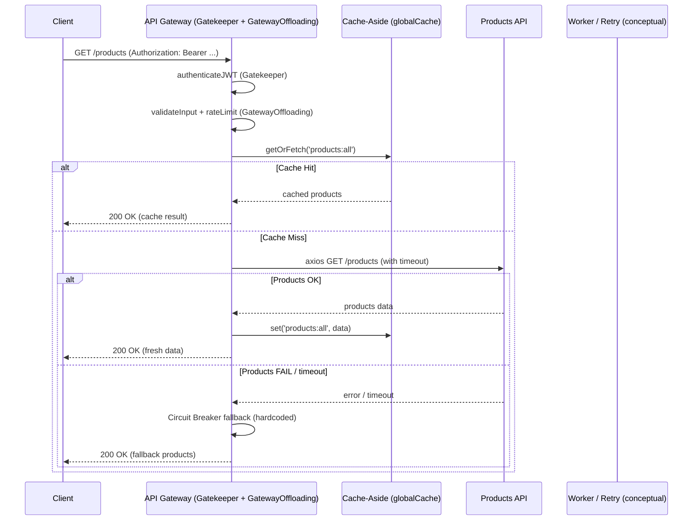
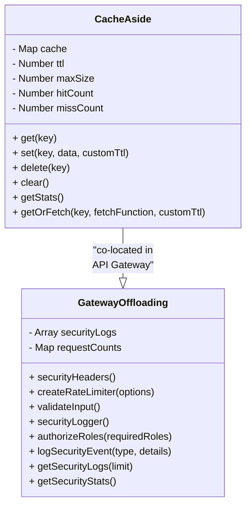
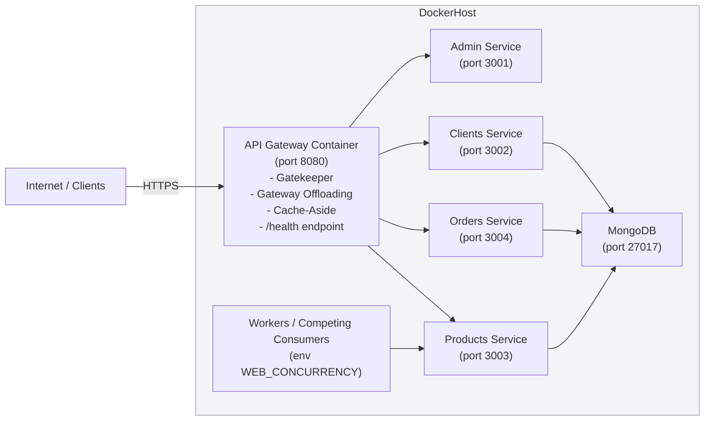

# Diagramas — Patrones implementados

---

## 1) Diagrama de secuencia — flujo GET /products (Cache-Aside + Gatekeeper + Circuit Breaker)

---

## 2) Diagrama de clases — principales clases que implementan patrones

---

## 3) Diagrama de despliegue — contenedores y responsabilidades (Docker / K8s)

---
