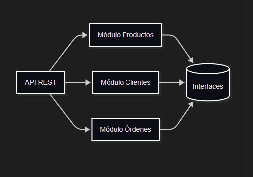

# Modelo de Componentes UML

Mermaid Code:

    flowchart LR
        API[API REST]
        Productos[Módulo Productos]
        Clientes[Módulo Clientes]
        Ordenes[Módulo Órdenes]
        Interfaces[(Interfaces)]

        API --> Productos
        API --> Clientes
        API --> Ordenes

        Productos ..> Interfaces
        Clientes ..> Interfaces
        Ordenes ..> Interfaces

## Descripción de componentes
- API REST: Recibe las peticiones y las envía al módulo correspondiente. Utiliza clustering con 8 workers para escalabilidad horizontal.
- Módulo Productos: Maneja la información de los productos.
- Módulo Clientes: Maneja la información de los clientes.
- Módulo Órdenes: Crea y muestra las órdenes usando datos de productos y clientes.
- Interfaces: Permiten que los módulos se comuniquen entre sí.

## Justificación de partición de primer nivel
La partición se realizó por dominio funcional (productos, clientes, órdenes) para facilitar escalabilidad, mantenimiento y despliegue independiente.

## Proceso para encontrar los componentes
Se analizaron los requerimientos del dominio e-commerce y se identificaron los módulos funcionales principales. Cada módulo expone interfaces para interacción y desacoplamiento.

## Contenedores vs Máquinas Virtuales
Se eligieron contenedores (Docker) por su ligereza, velocidad de despliegue y facilidad de escalado horizontal. Si se usaran máquinas virtuales, el despliegue sería más pesado y menos eficiente para escalar instancias rápidamente.

## ACID vs BASE
La demo utiliza servicios sin estado y simula operaciones BASE, priorizando disponibilidad y escalabilidad. Si se usara ACID, se sacrificaría escalabilidad y velocidad de respuesta por consistencia fuerte y transacciones.
